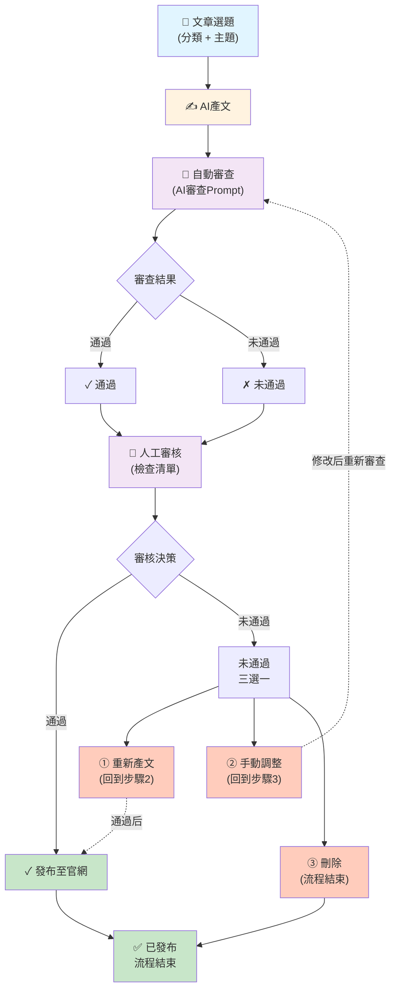

# 靈芝文章AI審核系統流程圖

## 整體系統流程



## 決策邏輯詳解

### 第一道關：AI自動審查

| 審查結果 | 流向 | 說明 |
|---------|------|------|
| ✓ 通過 | → 人工審核 | 文章符合三大規範 |
| ✗ 未通過 | → 人工審核 | 文章存在規範違反，需人工判斷 |

**AI審查三大規範：**
1. 禁止宣傳療效/醫療功效
2. 禁止虛假宣傳
3. 內容準確性檢查

---

### 第二道關：人工審核

編輯依據「人工審核檢查清單」進行審核，包括8個檢查項目：
- 內容準確性
- 符合規範
- 邏輯結構
- 目標受眾
- 品牌聲調
- 完整性
- SEO質量

#### 審核結果分支

**✓ 通過 → 發布至官網**
- 所有檢查項目滿足
- 發布流程結束

**✗ 未通過 → 三選一**

1. **① 重新產文** (回到步驟2)
   - 適用：文章方向完全不符、內容過時、AI質量不足
   - 無法通過修改達到標準

2. **② 手動調整** (回到步驟3)
   - 適用：問題為表述、段落結構、細節調整
   - 核心內容正確，只需潤色

3. **③ 刪除** (流程結束)
   - 適用：無法達到發布標準、修改成本過高、主題已過時
   - 存檔備用，放棄該選題

---

## 典型流程場景

### 場景1：優質內容（直接通過）
```
選題 → AI產文 → AI審查✓通過 → 人工審核✓通過 → 發布 ✅
```
**週期：2-3天**

### 場景2：規範違反（人工調整）
```
選題 → AI產文 → AI審查✗未通過 → 人工審核②手動調整 
→ AI重新審查✓通過 → 發布 ✅
```
**週期：3-4天**

### 場景3：完全不符（重新產文）
```
選題 → AI產文 → AI審查✗未通過 → 人工審核①重新產文 
→ AI產文(第2次) → AI審查✓通過 → 發布 ✅
```
**週期：4-5天**

### 場景4：主題廢棄（刪除）
```
選題 → AI產文 → 人工審核③刪除 → 存檔 ⏹️
```
**週期：1-2天**

---

## 系統狀態統計

系統運作應追蹤以下關鍵指標：

| 指標 | 目標 | 說明 |
|------|------|------|
| AI自動審查通過率 | ≥80% | 直接通過的文章比例 |
| 人工審核通過率 | ≥90% | AI審查+人工審核的總通過率 |
| 重新產文比例 | ≤10% | 通常表示AI Prompt需優化 |
| 手動調整比例 | 5-15% | 正常範圍，表示編輯有效調整 |
| 刪除比例 | ≤5% | 正常範圍，廢棄的選題比例 |
| 平均週期 | 2-3天/篇 | 從選題到發布的平均時間 |

---

版本：1.0 | 製作日期：2026年5月5日
